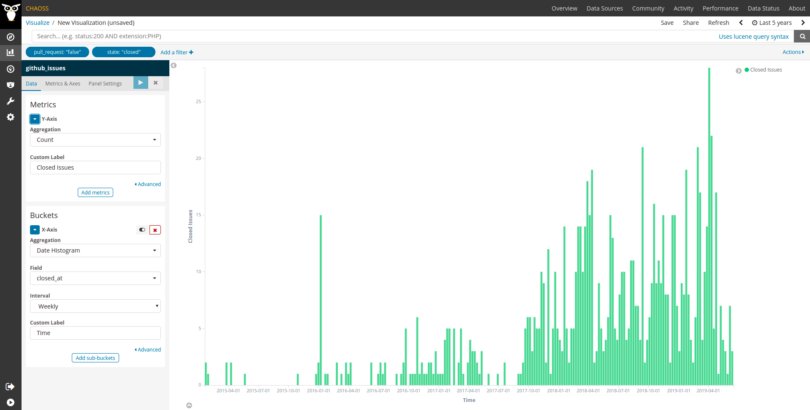

# Issues Closed

Question: How many issues were closed during a certain period?

## Description

Issues are defined as in [Issues New](https://chaoss.community/metric-issues-new/).
Issues closed are those that changed to state closed
during a certain period.

In some cases or some projects, there are other states
or tags that could be considered as "closed".
For example, in some projects they use the state or
the tag "fixed" for stating that the issue is closed,
even when it needs some action for formally closing it.

In most issue trackers, closed issues can be reopened
after they are closed. Reopening an issue can be considered
as opening a new issue, or making void the previous close
(see parameters, below).

For example, in GitHub Issues or GitLab Issues, issues closed are
issues that were closed during a certain period.

## Objectives

Volume of issues that are dealt with in a project.
Closed issues are a proxy for the activity in a project.
By counting closed issues related to code in the set of repositories corresponding
to a project, you can have an idea of the overall activity in
finishing work with issues in that project.
Of course, this metric is not the only one that should be
used to track volume of coding activity.

## Implementation

**Aggregators:**
* Count. Total number of active issues during the period.
* Ratio. Ratio of active issues over total number of issues during that period.
* Reactions. Number of "thumb-ups" or other reactions on issues.

**Parameters:**
* Period of time. Start and finish date of the period during which issues are considered. Default: forever.  

* Criteria for source code. Algorithm. Default: all issues are related to
  source code.  
    If we focus on source code, we need a criterion for deciding
    whether an issue is related to the source code or not.
    All issues could be included in the metric by altering the default. 

* Reopen as new. Boolean, defining whether reopened issues are considered
  as new issues. If false, it means the closing event previous to a
  reopen event should be considered as void. Note: if this parameter is
  false, the number of closed issues for any period could change in the
  future, if some of them are reopened.

* Criteria for closed. Algorithm. Default: having a closing event during
  the period of interest.

### Filters 

* By actors (submitter, commenter, closer). Requires merging identities corresponding to the same author.

* By groups of actors (employer, gender... for each of the actors).
Requires actor grouping, and likely, actor merging.

### Visualizations 

* Count per time period over time
* Ratio per time period over time

These could be grouped by applying the filters defined aboce.
These could be represented as bar charts, with time running in the X axis.

### Tools Providing the Metric 

* [GrimoireLab](https://chaoss.github.io/grimoirelab) provides data for computing this metric for GitHub Issues, GitLab issues, Jira, Bugzilla and Redmine. Current dashboards show information based on creation date, that means they show current status of the issues that were created during a time period (e.g. [GitHub Issues dashboard](https://chaoss.github.io/grimoirelab-sigils/panels/github-issues/), you can [see it in action](https://chaoss.biterg.io/app/kibana#/dashboard/GitHub-Issues)). Nevertheless, it is easy to build a visualization that shows issues based on closing date by following the next steps:
  - Add a sample visualization to any GrimoreLab Kibiter dashboard following these instructions:
    * Create a new `Vertical Bar` chart.
    * Select the `github_issues` index.
    * Filter: `pull_request` is `false`.
    * Filter: `state` is `closed`.
    * Metrics Y-axis: `Count` Aggregation, `# Closed Issues` Custom Label.
    * Buckets X-axis: `Date Histogram` Aggregation, `closed_at` Field, `Weekly` Interval (or whatever interval may fit your needs, depending on the whole time range you wish to visualize in the chart), `Time` Custom Label.
  - Example screenshot: .

### Data Collection Strategies 

**Specific description: GitHub**

In the case of GitHub, closed issues are defined as "issues which are closed". 

**Specific description: GitLab**

In the case of GitLab, active issues are defined as "issues
that are closed".

**Specific description: Jira**

In the case of Jira, active issues are defined as "issues that change to the closed state". 

**Specific description: Bugzilla**

In the case of Bugzilla, active issues are defined as "bug reports that change to the closed state".

## References

